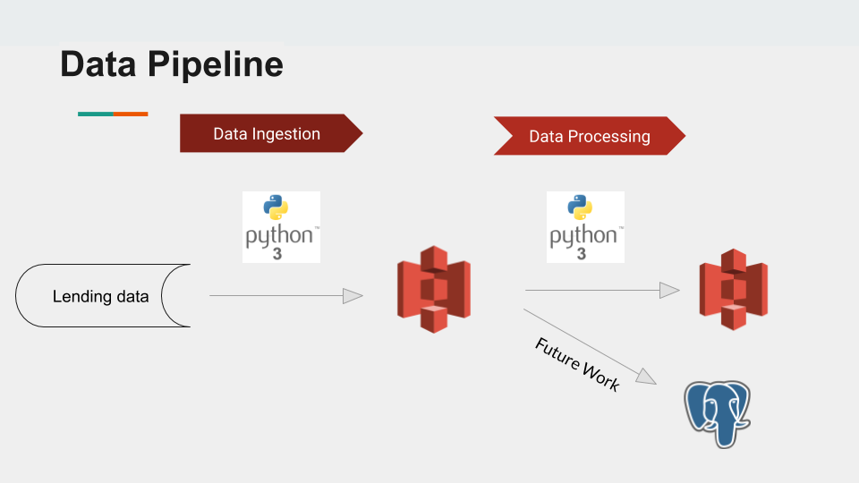
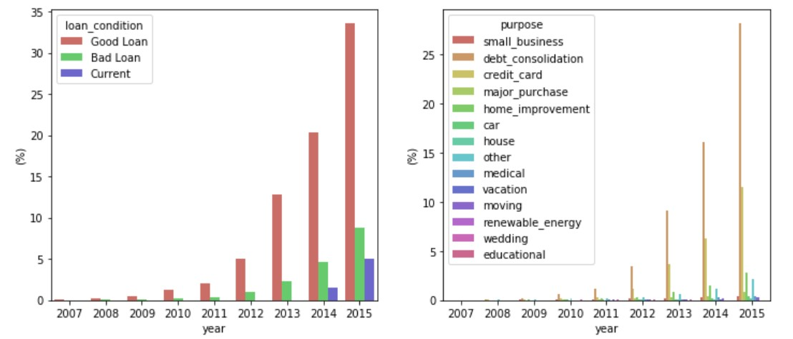

# LendingClub

## Table of Contents

1. [Overview](#overview)
2. [Dataset](#dataset)
3. [Data Exploration](#dataexploration)
4. [Data Processing](#dataprocessing)
5. [Database](#database)
6. [Visualization](#visualization)
7. [FutureWork](#FutureWork)

# Overview
LendingClub is the world's largest peer-to-peer lending platform, where investors provide funds for potential borrowers and investors earn a profit. This project consists of two parts:

1.The first part is to analyze the lending club dataset from 2007 to 2015. I am trying to explore the data and find valuable information from business perspetive and risk perspective. 

2.The second part is to build a pipleline to ingest and process the data in a efficient way. Following along the pipeline, I first ingest the dataset with a total size of 1.1G from the data source provided to AWS S3; clean and validate the dataset in Python3, and then save the dataset in S3.


The structure of the directory is mapped according to this tree:
```
backtesting
    |- data_pipeline.png
    |- README.md
    |- loan_analysis.ipynb
    |- src
        |- run.sh
        |- write_clean_df.py
        |- data_cleaning.py
        |- config.ini
```

# Dataset

|Number of files|Size of csv file|
|---|---|
|1 csv|1.1 GB|
|1 xlsx|23 KB|

There are two files,one is the loan data file which is csv format, another one is associated dictionary from which is a xlsx format.
The csv file have 145 columns and 2260668 rows.

# Data Exploration
In this section, I analyzed the lending club dataset from 2007 to 2015. I explored the data and found some valuable information from business perspetive and risk perspective.
## Outlier
### Distributions and Basic Information
 Summary: 
 1. Most of loans were issused with a interest rate beteen %7 to 16%
 2. Most of loans were issued with the number between 10000 to 20000 USD dollars
 3. Both of issued loan numbers and loan amount were having exponentially increasing along the year
 4. From 2007-2015, bad loans consist 17.5% of total loans,this percentage is subjected to possible changes.
 5. The reason that clients applied the most for a loan was to consolidate debt and credit cards.
 6. Clients applied less for educational purposes for all three income categories.
 7. Wedding and Cars have the highest ratio of good loans

### Business Pespective
#### Analysis by State
Summary:
 1. DC,NJ,CT,MD,VA are the states having the highest average annual income. DC meanwhile has a relatively low loan amount and interest rate, the reason might be the high annual income. 
 2. CA,TX,NY,FL,IL are the states having the highest loan amount applied. The annual income are all above average and that may be the reason why most loans were issued there.
 
#### Analysis by Income and Employment Length Categories
Summary:
 1. Hign income people's top loan purpose is small business; Medium income people's top loan purpose is home improvement; Low income people's top loan purpose is education. 
 2. Junior level people have a high weight loan on education, it might because junior people were still paying for the student loan. Senior level people have a high weight loan on vacation and renewable_energy except people with 10+ employment length has the highest weight loan on home improvent.
    
### Risk Perspective
 Summary
 1. Low income group tends to have higher bad_loan/good_loan ratio
 2. People having small business loan purpose tend to have a higher risk of being a bad loan
 3. The interest rate for house is hign, and the bad_loan/good_loan ratio is not high, so it seems a good business to provide loan for house
 
data_analysis.ipynb is the reference for details

# Data Processing
This section includes data cleaning and data validation:
1. Remove columns with only one value
2. Remove columns with more than 90% missing data 
3. Remove columns with redundant information
4. Remove duplicates
5. Convert date columns from string to datetime type
6. Conver emplotment length from  string to integer type
7. Flag negative numbers
8. Flag outliers
9. Flag invalid categories

# Database
I choose PostgreSQL as the database because it is a extensible and convenient RDAMS and it provides legendary reliability and stability.

# Visualization
All the data visualization are saved at data_analysis,ipynb. Here are a few example:

This figure shows the percentage of employment length along the loan purpose


The following figures show the distribution of loan condition and loan purpose along the year


# FutureWork
1. Create a batabase and write the data to the database
2. There are definitely more analysis we can do
3. Add more data validations during the data processing
4. Add unit tests during the data processing
5. Add a airflow to automate the whole process
6. Add monitors along the whole pipeline


